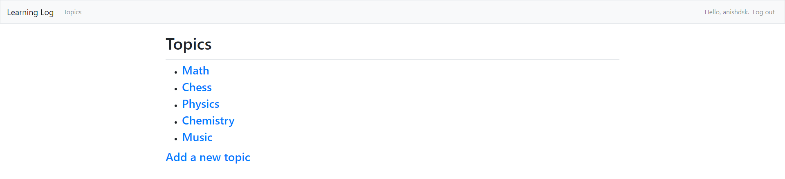

# Learning-Log

## URL:

### My Heroku account is experiencing problems at the moment. I contacted Heroku to fix it so the URL may be down for a couple days. I have uploaded images of the web-app's pages and features at the bottom of the README that you can look at in the meantime.

https://simplelearninglog.herokuapp.com/

*Load times may take a bit longer sometimes as Heroku puts the app to sleep if it has been idle for a while*

## Overview & Technical Feayures:
Users can log information about topics they're learning about and make detailed entries as they learn about each topic.

      - Utilized Python's Django web-framework to handle/route data between webpages and the backend/database
      - Implemented user login/registration and authentication using Django's built-ins for forms and security
      - Used SQLite to hold information about data models (Topics, Entries, Users, primary/foreign keys)
      - Each Topic's Entries are timestamped for improved organization and logging purposes
      - Each user's data is preserved between logins unless the user deletes it themselves
      - Used HTML and Bootstrap to make responsive webpages
      - Administrator privileges are held by me
      - Created within a virtual environment 
      - Deployed to Heroku
      
## Images:

### Homepage

### Registration Page

### Login Page

### Add Topic page

### All Topics page

### Add Entry page

### All Entries page

      
